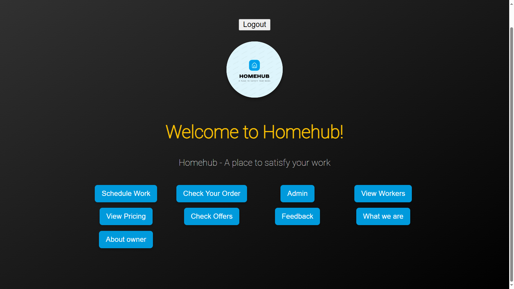
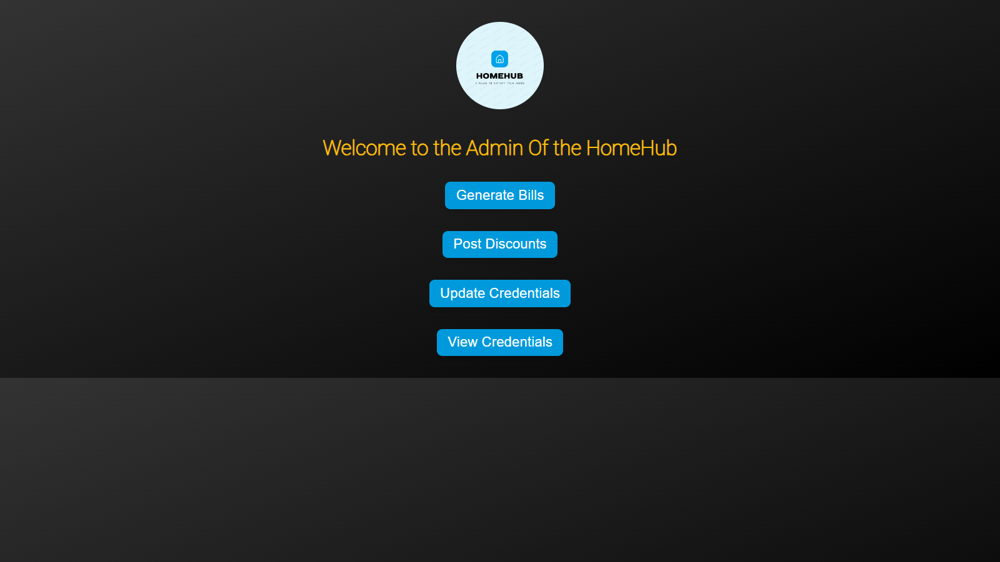

# HomeHub


Welcome to **HomeHub**, your one-stop solution for all home service needs. Whether you need an electrician, plumber, or carpenter, HomeHub connects you with trusted professionals to get the job done right.

## Table of Contents
- [About](#about)
- [Features](#features)
- [Screenshots](#screenshots)
  - [User Menu](#user-menu)
  - [Admin Menu](#admin-menu)
- [Installation](#installation)
- [Usage](#usage)
  - [User Guide](#user-guide)
  - [Admin Guide](#admin-guide)
- [Endpoints](#endpoints)
- [Contributing](#contributing)
- [License](#license)
- [Contact](#contact)

## About
HomeHub aims to make home services easy and accessible. We provide a platform where users can schedule various services, view pricing, and manage their orders. Our admin panel allows administrators to generate bills, post discounts, and manage credentials efficiently.

## Features
- **User Features:**
  - Schedule Work
  - View Pricing
  - Check Your Order
  - View Team
  - Request Changes
  - Cancel Orders
  - Feedback
  - About the Owner
- **Admin Features:**
  - Generate Bills
  - Post Discounts
  - Manage Credentials

## Screenshots

### User Menu


### Admin Menu


## Installation
To get a local copy up and running, follow these simple steps.

### Prerequisites
- Python 3.x
- Django
- Other dependencies listed in `requirements.txt`

### Installation Steps
1. Clone the repository
   ```sh
   git clone https://github.com/your-username/homehub.git
Navigate to the project directory
sh
Copy code
cd homehub
Install dependencies
sh
Copy code
pip install -r requirements.txt
Run the Django development server
sh
Copy code
python manage.py runserver
Usage
User Guide
Home Page:

Visit the home page to get an overview of the services offered by HomeHub.
Schedule Work:

Navigate to the schedule work page, fill out the form with necessary details, and submit it to schedule a service.
View Team:

View the profiles of the professionals available for different services.
Request Changes:

If you need to make changes to an existing order, use the request changes page.
Cancel Orders:

Cancel your order by filling out the cancellation form.
Feedback:

Provide feedback about your experience with HomeHub services.
Admin Guide
Admin Home:

Access the admin home page to manage services and other administrative tasks.
Generate Bills:

Use the generate bills page to create invoices for completed services.
Manage Admin Passwords:

Admins can manage passwords for various admin credentials.
Endpoints
Home: /home2
Schedule Work: /schedule_work
Confirmation: /confirmation
Summary: /summery
Request Changes: /request_changes
Charge: /charge
View Team: /view_team
View Rates: /view_rates
Cancel Order: /cancel
Feedback: /feedback
What We Are: /what_we_are
About Owner: /about_owner
Admin Home: /admin_home
Admin Password: /admin_password
Generate Bills: /generate_bills
Special: /special
Manage Admin Passwords: /manage_admin_passwords
Contributing
Contributions are what make the open-source community such an amazing place to learn, inspire, and create. Any contributions you make are greatly appreciated.

Fork the Project
Create your Feature Branch (git checkout -b feature/AmazingFeature)
Commit your Changes (git commit -m 'Add some AmazingFeature')
Push to the Branch (git push origin feature/AmazingFeature)
Open a Pull Request
License
Distributed under the MIT License. See LICENSE for more information.

Contact
Founder: Vishal
Email: vishaldudhabarve105@gmail.com.com
Follow us on:

LinkedIn
Facebook
GitHub
Instagram
WhatsApp
This README was generated with ❤️ by HomeHub Team.